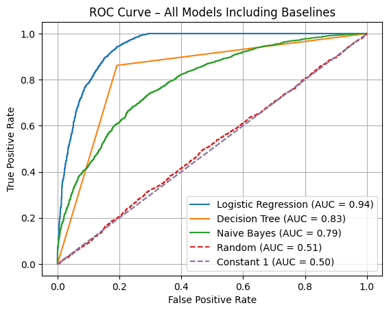

# Predicting Court Judgements using simple machine learning models
author: Jędrzej Wydra

## Short summary
Developed and evaluated several classification models in Python to predict binary outcomes of legal decisions based on structured metadata from the European Court of Human Rights (ECHR). The models included logistic regression, Naive Bayes, and decision trees, with particular attention to the impact of feature normalization on predictive performance.

## Technical summary
The project used a curated dataset of 11.5K ECHR cases, containing language codes, case identifiers, respondent countries, dates, court branches, importance levels, and human-assigned binary judgement labels. The task was framed as a binary classification problem: identifying whether a given case results in a finding of a violation or not.

All preprocessing and modeling steps were performed using Python, with pandas for data wrangling, scikit-learn for model implementation and evaluation, and matplotlib for visualization. Logistic regression was tested both with and without feature normalization using standard scaling. Additionally, two baseline strategies were included: random guessing, and a heuristic proxy based on the assumption that lawyers only pursue winnable cases ("attorney prediction").

Experiments showed that linear models were sensitive to normalization, while tree-based models were robust. Overall, the results support the idea that court decisions reflect underlying regularities that can be captured with relatively simple classifiers.

## Results

The chart below compares the performance of all models on the test set.

## Dataset
The project is based on the ECHR Open Data dataset, consisting of over eleven thousand legal cases extracted from the European Court of Human Rights' public database and further annotated by human experts. Each case includes metadata such as the procedural branch, ISO country code of the respondent, language, importance rating, and a short conclusion. The dataset is split into training, development, and test partitions, and each instance is labeled with a binary judgement indicating whether a human rights violation was found.

The original dataset was introduced and described in detail in the associated publication (please cite accordingly if reusing). It is publicly available for research purposes and can be downloaded from the project website.

## History
Can court judgements be predicted? It’s a controversial question — and rightfully so. But I wasn’t looking to replace judges with algorithms. Instead, I was curious: do judicial decisions follow patterns clear enough that a machine learning model can find them?

Using a dataset of over 11,000 cases from the European Court of Human Rights, I tested several models: logistic regression, Naive Bayes, decision trees, and a few intentionally naïve baselines. I also included a fun twist — a classifier based on the idea that attorneys only take cases they believe they can win. If the lawyer thought they could win, did the Court agree?

The results were surprisingly promising. Simple models outperformed random baselines. That doesn’t mean machines can replace judges — it means judges don’t act arbitrarily. And that’s good news.

One interesting note: I ran the models with and without feature normalization. Only logistic regression cared.

## Limitations and future work
The dataset itself, while rich, may not be fully representative of all legal systems or court dynamics. Moreover, outcome imbalance, label ambiguity, and jurisdiction-specific factors could affect generalizability.

Future work could include incorporating natural language features from the case documents, exploring fairness-related metrics, or applying the same framework to other courts or legal domains. Another interesting direction would be to model attorney behavior more directly and analyze its correlation with court decisions over time.

## Side note
This isn’t about automating justice — it’s about understanding it. If a machine can spot a pattern in court decisions, it might just mean that legal reasoning is more structured than we fear. And in times when trust in institutions is shaken, that’s something worth finding out.
